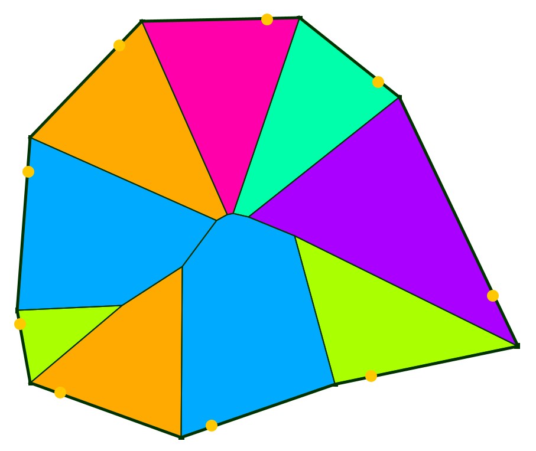

[](https://jitpack.io/#twak/campskeleton)
[](https://opensource.org/licenses/Apache-2.0)

Weighted straight skeleton implementation in java. [Video](http://www.youtube.com/watch?v=2twcln3_7Y8).

Allows negative weights for offsetting in either direction. Implementation of [Felkel's](http://www.dma.fi.upm.es/mabellanas/tfcs/skeleton/html/documentacion/Straight%20Skeletons%20Implementation.pdf) algo with robustness - described [here](http://twak.blogspot.com/2009/05/engineering-weighted-straight-skeleton.html).

## Run


Run the [jar](https://drive.google.com/open?id=0B6r_mUgXfBLdVTRfSE04MzB2Tlk) with:

```
java -jar campskeleton-0.0.1-SNAPSHOT-jar-with-dependencies.jar
```

There's a primitive gui interface. Use left mouse button to move points and control-click to add new points.

## Build
To build run the command `mvn install` to install the dependencies. Then the command `mvn package` should build a jar.

Use `mvn install -P dev` and `mvn package -P dev` to use development profile (for custom module dependency to [my jutils](https://github.com/twak/jutils)).

## Integration

### Maven
Add this to your `pom.xml` to use latest snapshot in your project:

```
<repositories>
    <repository>
        <id>jitpack.io</id>
        <url>https://jitpack.io</url>
    </repository>
</repositories>

<dependency>
    <groupId>com.github.twak</groupId>
    <artifactId>campskeleton</artifactId>
    <version>master-SNAPSHOT</version>
</dependency>
```

### Gradle
Add this in your root `build.gradle` at the end of repositories to use latest snapshot:

```
allprojects {
    repositories {
        ...
        maven { url 'https://jitpack.io' }
    }
}

dependencies {
        implementation 'com.github.twak:campskeleton:master-SNAPSHOT'
}
```

## Examples
Main UI class is [org.twak.camp.debug.CampSkeleton](https://github.com/twak/campskeleton/blob/master/src/org/twak/camp/debug/CampSkeleton.java). 

[Example](https://github.com/twak/campskeleton/blob/wiki/headless.md) headless code.

## License
See [Apache License 2.0](LICENSE.md).
This is a component of a [research project](http://twak.blogspot.com/2011/04/interactive-architectural-modeling-with.html) - if you use it, please cite us:

<pre>
@article{kelly2011interactive,
  title={Interactive architectural modeling with procedural extrusions},
  author={Kelly, Tom and Wonka, Peter},
  journal={ACM Transactions on Graphics (TOG)},
  volume={30},
  number={2},
  pages={14},
  year={2011},
  publisher={ACM}
}
</pre>
